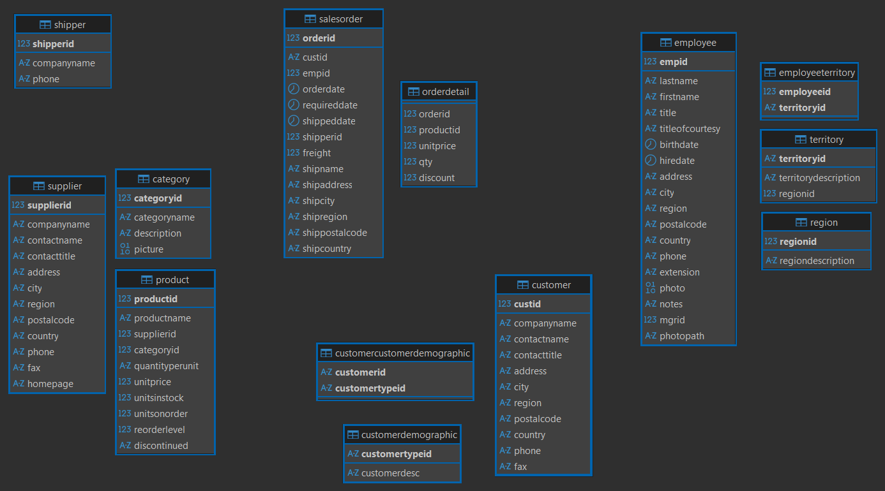
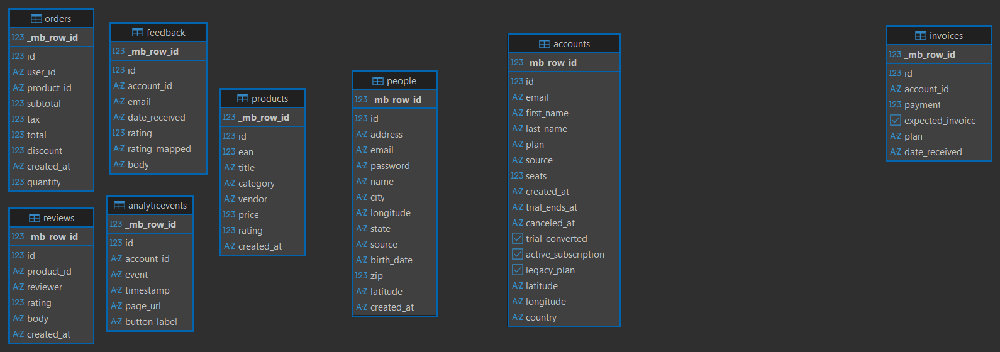
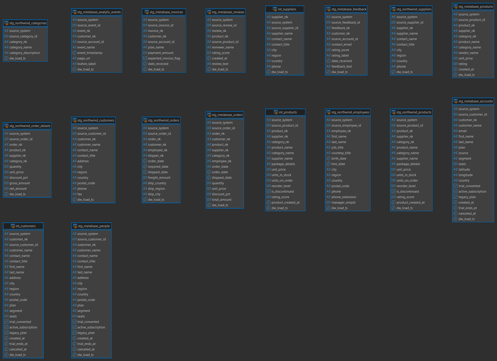
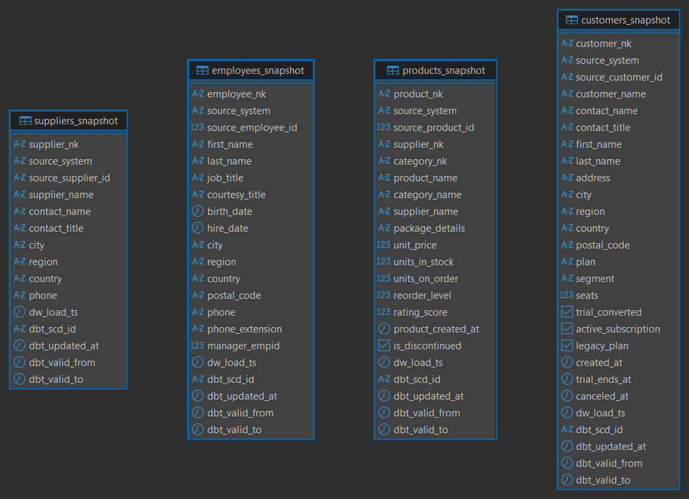
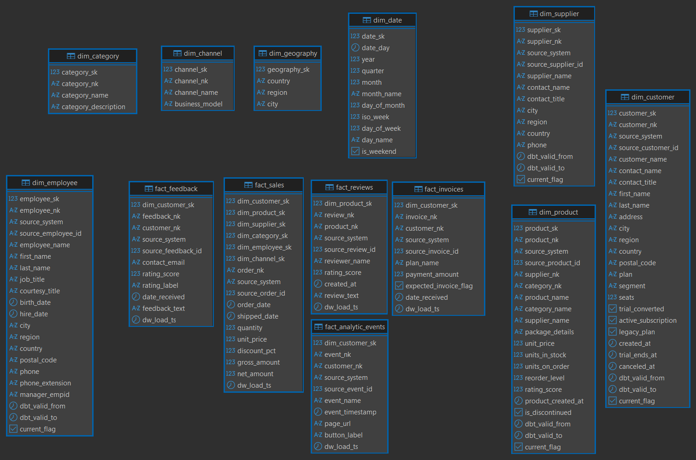
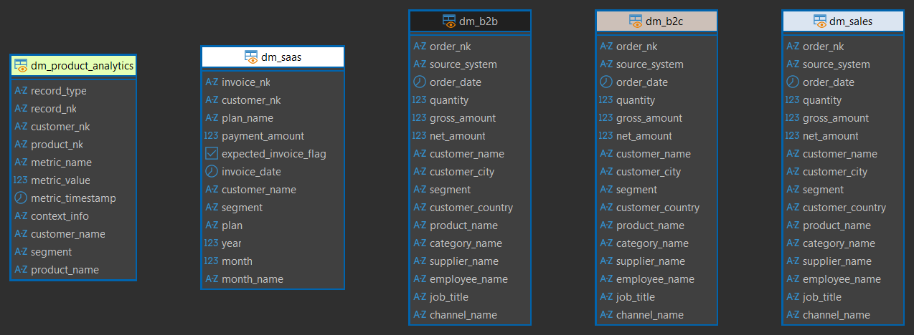

# Data Warehouse Northwind + Metabase (dbt + PostgreSQL)

Projeto acadêmico que consolida as bases **Northwind** (ERP B2B) e **Metabase Sample** (SaaS B2C) em um Data Warehouse no PostgreSQL 12, modelado e orquestrado via **dbt**. 

*Utilizamos o PostgreSQL 12 pela facilidade de já
termos instalado na máquina, mas o código é aderente a
versões mais recentes.* 

## Arquitetura lógica

- **RAW (origem):** `northwind.public`, `sample_metabase_pg.public` (expostos via FDW no banco `dw_northwind_metabase`).
- **STG (`dw_stg`):** views de normalização (`stg_northwind_*`, `stg_metabase_*`) com NKs padronizadas e conversão de tipos.
- **Intermediária (`dw_stg`):** `int_customers`, `int_products`, `int_suppliers` consolidam fontes antes dos snapshots.
- **Snapshots (`snapshots`):** `customers_snapshot`, `products_snapshot`, `suppliers_snapshot`, `employees_snapshot` (SCD2).
- **DW core (`dw_dw`):** dimensões SCD2 (`dim_customer`, `dim_product`, `dim_supplier`, `dim_employee`) e dimensões padrão (`dim_category`, `dim_date`, `dim_geography`, `dim_channel`) com fatos (`fact_sales`, `fact_invoices`, `fact_feedback`, `fact_reviews`, `fact_analytic_events`).
- **Data marts (`dw_dm_*`):** `dm_sales`, `dm_b2b`, `dm_b2c`, `dm_saas`, `dm_product_analytics`.


## Pré-requisitos

- **Python 3.13+** (uso de `venv` recomendado).
- **dbt-postgres 1.9.1** (instalado no `.venv`).
- **PostgreSQL 12** local: host `localhost`, porta `5433`, usuário `postgres`, senha `123456`, banco `dw_northwind_metabase`. (mude esses parâmetros se necessário em sua base.)
- Bases de dados de origem: `northwind` e `sample_metabase_pg` (ambos no PostgreSQL). Na pasta Documentos há os dumps dessas bases.
- Tabelas de origem acessíveis via FDW no schema `public` do DW (explicação na próxima seção).

### Configurando o PostgreSQL FDW
Execute no banco `dw_northwind_metabase` (ajuste host/porta/credenciais se necessário):
```sql
CREATE EXTENSION IF NOT EXISTS postgres_fdw;

-- Servidor Northwind
CREATE SERVER IF NOT EXISTS northwind_srv
  FOREIGN DATA WRAPPER postgres_fdw
  OPTIONS (host 'localhost', port '5433', dbname 'northwind');
CREATE USER MAPPING IF NOT EXISTS FOR postgres
  SERVER northwind_srv
  OPTIONS (user 'postgres', password '123456');
IMPORT FOREIGN SCHEMA public LIMIT TO (
  customer, salesorder, orderdetail,
  product, category, supplier, employee
) FROM SERVER northwind_srv INTO public;

-- Servidor Metabase Sample
CREATE SERVER IF NOT EXISTS metabase_srv
  FOREIGN DATA WRAPPER postgres_fdw
  OPTIONS (host 'localhost', port '5433', dbname 'sample_metabase_pg');
CREATE USER MAPPING IF NOT EXISTS FOR postgres
  SERVER metabase_srv
  OPTIONS (user 'postgres', password '123456');
IMPORT FOREIGN SCHEMA public LIMIT TO (
  accounts, orders, products, people,
  invoices, feedback, reviews, analyticevents
) FROM SERVER metabase_srv INTO public;
```
> Pode importar todo o schema se preferir; o essencial é que as tabelas usadas em `stg_*` estejam visíveis em `public`.


## Primeira configuração
- Criação e ativação do ambiente virtual:
  - **Windows (PowerShell):**
    ```powershell
    python -m venv .venv
    .\.venv\Scripts\activate
    ```
  - **Linux/macOS (bash/zsh):**
    ```bash
    python -m venv .venv
    source .venv/bin/activate
    ```
- Instalar dependências e apontar para o projeto dbt:
  ```powershell
  .\.venv\Scripts\pip install -U pip dbt-postgres
  cd ".\dbt\dw_northwind_metabase"
  $env:DBT_PROFILES_DIR = (Get-Location)
  ```

## Execução recomendada
Sempre que alterar o fluxo, rode na ordem:
```powershell
dbt run --select tag:staging                           # staging (dw_stg)
dbt run --select intermediate                          # int_customers/int_products/int_suppliers
dbt snapshot --select products_snapshot suppliers_snapshot employees_snapshot customers_snapshot # aplica SCD2 em produtos/fornecedores/colaboradores/clientes
dbt run --select dim_customer dim_product dim_supplier dim_employee dim_category dim_date dim_geography dim_channel fact_sales fact_invoices fact_feedback fact_reviews fact_analytic_events  # dimensões/fatos (dw_dw)
dbt run --select dm_sales dm_b2b dm_b2c dm_saas dm_product_analytics  # marts (dw_dm_*)
dbt test --select tag:staging intermediate `
                   dim_customer dim_product dim_supplier dim_employee dim_category dim_date dim_geography dim_channel `
                   fact_sales fact_invoices fact_feedback fact_reviews fact_analytic_events stg_metabase_people
```
> O dbt cria schemas com prefixo `dw_` (ex.: `dw_stg`, `dw_dw`, `dw_dm_sales`). Use `dbt ls --select <pattern>` para checar seletores se necessário.

## Estrutura de pastas (resumo)
```
dbt/dw_northwind_metabase/
├── models/
│   ├── staging/
│   ├── intermediate/
│   ├── dw/
│   └── marts/
├── snapshots/
├── macros/
├── dbt_project.yml
└── profiles.yml
```

## Verificação / diagnóstico
- `dbt debug` — checa credenciais e conexão.
- `dbt run --select <modelo>` — recompila modelo específico.
- `dbt test` — executa testes (not null, unique, relationships).
- `dbt docs generate` / `dbt docs serve` — documentação navegável (opcional).

## Controle histórico (SCD Type 2)
Foi utilizado o padrão de snapshots do dbt (`*_snapshot.sql`, estratégia `check`) para historificar clientes, produtos, fornecedores e colaboradores. A cada `dbt snapshot`, o dbt compara o hash das colunas monitoradas (definidas em `check_cols`) com a versão anterior. Se houver mudança, encerra o registro anterior (`dbt_valid_to`) e cria nova linha com `dbt_valid_from`. As dimensões (`dim_customer`, `dim_product`, `dim_supplier`, `dim_employee`) filtram `dbt_valid_to IS NULL` para estado corrente e expõem `dbt_valid_from`/`dbt_valid_to`/`current_flag` para consultas históricas.

**Resultado prático**:
- Mudanças nas colunas monitoradas geram nova versão, suportando análises “as of”.
- Métricas podem ser reconstituídas conforme o contexto temporal.
- Relatórios históricos juntam a fato ao intervalo de validade na dimensão.

Estratégia baseada no guia: https://docs.getdbt.com/docs/build/snapshots#check-strategy

### Estratégias de Snapshot: Check vs Timestamp

Para fins de documentação, existem duas estratégias principais para snapshots no dbt:

1.  **Timestamp (Ideal)**:
    *   **Como funciona**: O dbt confia em uma coluna de auditoria na origem (`updated_at`) para saber *exatamente* quando o registro mudou.
    *   **Vantagem**: Precisão total. Mudanças intra-dia são capturadas com o horário exato.
    *   **Por que não usamos**: As tabelas do Metabase (`people`, `products`) não possuem uma coluna `updated_at` confiável.

2.  **Check (Adotada)**:
    *   **Como funciona**: O dbt compara o hash das colunas monitoradas (`check_cols`) com a versão anterior.
    *   **Limitação (Delay)**: A mudança só é detectada quando o snapshot roda. Ex: Se o cliente muda às 14h e o snapshot roda às 23h, para o DW a mudança ocorreu às 23h.
    *   **Mitigação**: Execução diária do pipeline para minimizar a janela de latência para < 24h.

Este foi o maior desafio do projeto. Iniciamos com a estratégia timestamp, realizando a criação de triggers na base original para que ao atualizar o cliente ou produto, o banco adicionasse uma coluna updated_at com a data e hora da atualização. Isso trouxe complexidade ao projeto e no mundo real, nem sempre temos autorização para alterar a base de dados original. Então optamos pela estratégia check, sabendo que há uma latência a ser considerada, o que costuma ser irrisório para um DW em que a latência é de 24h horas, por exemplo. Se essa perda não fosse aceitável, seria necessário implementar uma estratégia de timestamp, alterando a base original.

### Colunas Monitoradas (Check Strategy)
Abaixo estão as colunas configuradas (`check_cols`) para detecção de mudanças em cada snapshot:

| Entidade | Colunas Monitoradas |
| :--- | :--- |
| **Customers** | `customer_name`, `contact_name`, `first_name`, `last_name`, `address`, `city`, `region`, `country`, `postal_code`, `plan`, `segment`, `seats`, `active_subscription`, `canceled_at` |
| **Products** | `product_name`, `supplier_name`, `unit_price`, `rating_score` |
| **Suppliers** | `supplier_name`, `contact_name`, `city`, `region`, `country` |
| **Employees** | `first_name`, `last_name`, `job_title`, `city`, `region`, `country`, `postal_code`, `manager_empid` |

### Tratamento de Carga Inicial (Backdating)
Para garantir que fatos históricos (ex: vendas de 1998) possam ser vinculados corretamente às dimensões SCD2, foi implementada uma lógica de "Backdating" nas dimensões (`dim_customer`, `dim_product`, etc.).

- **Lógica**: Se um registro for a **primeira versão** conhecida E sua data de entrada for anterior à `data_hora_carga_inicial` (definida em `dbt_project.yml`), sua data de início (`dbt_valid_from`) é forçada para `1900-01-01`.
- **Objetivo**: Evitar que dados antigos fiquem órfãos (sem dimensão correspondente) na carga inicial, enquanto preserva a data real de entrada para novos registros criados no futuro (pós-carga).

Configuração em `dbt_project.yml`:
```yaml
vars:
  data_hora_carga_inicial: '2025-11-23 00:00:00' (EXEMPLO)
```

### Exemplos de consultas (corrente vs histórico)

**Importante:** A tabela de Fatos (`fact_sales`) já realiza o join correto com as dimensões considerando a data do fato (`order_date`).
- O join **NÃO** deve ser feito com a tabela de snapshot (`snapshots.*`).
- O join deve ser feito com a dimensão (`dw_dw.dim_*`), que já possui a regra de backdating aplicada.

Exemplo de como a `fact_sales` resolve a chave substituta (SK) correta:
```sql
-- Exemplo conceitual do join na fact_sales
left join {{ ref('dim_customer') }} dc
    on s.customer_nk = dc.customer_nk
    and s.order_date >= coalesce(dc.dbt_valid_from, timestamp '1900-01-01')
    and s.order_date <  coalesce(dc.dbt_valid_to,   timestamp '9999-12-31')
```
Graças ao backdating para `1900-01-01`, vendas antigas (ex: 1998) encontram seu registro de cliente correspondente na dimensão, mesmo que o snapshot tenha sido criado apenas hoje.

---
Sinta-se à vontade para ajustar `profiles.yml` (host, usuário, senha) conforme o ambiente. Qualquer mudança adicional em fontes ou métricas deve seguir a trilha de execução acima para manter o DW sincronizado.

### Exemplo do SCD2 em Ação
1) Inserções iniciais (v1) – base sample_metabase_pg
Pessoas v1
```sql
insert into public.people (id, name, email, city, state, source, created_at) values
  (9001, 'Alice Ramos',  'alice.ramos@example.com',  'São Paulo', 'SP', 'web', current_timestamp),
  (9002, 'Bruno Nogueira','bruno.nogueira@example.com','Campinas','SP','web', current_timestamp);

-- Produtos v1
insert into public.products (id, title, category, vendor, price, rating, created_at) values
  (9001, 'Fone Bluetooth Conforto', 'Áudio',     'AudioMax Brasil', 299.00, 4.7, current_timestamp),
  (9002, 'Relógio Esportivo Ativo', 'Wearables', 'TechNova Brasil', 199.00, 4.5, current_timestamp);

-- Compra antes da mudança (cliente 9001, produto 9001)
insert into public.orders (id, user_id, product_id, subtotal, tax, total, discount____, created_at, quantity) values
  (20001, 'Alice Ramos', 'Fone Bluetooth Conforto', 299.00, 29.90, 328.90, 0.00, current_timestamp, 1);

```
2) Rodar o dbt (refletir v1)
No projeto dbt (dbt/dw_northwind_metabase), com venv ativo e --DBT_PROFILES_DIR setado:
```powershell
dbt run --select tag:staging
dbt run --select intermediate
dbt snapshot --select products_snapshot suppliers_snapshot employees_snapshot customers_snapshot
dbt run --select dim_customer dim_product dim_supplier dim_employee dim_category dim_date dim_geography dim_channel fact_sales fact_invoices fact_feedback fact_reviews fact_analytic_events
dbt run --select dm_sales dm_b2b dm_b2c dm_saas dm_product_analytics
```
3) Updates + nova compra (v2) – base sample_metabase_pg
Agora altere atributos e insira a nova compra.
```sql
-- Cliente muda de cidade
update public.people set city = 'Santos' where id = 9001;

-- Produto muda preço
update public.products set price = 279.00 where id = 9001;

-- Nova compra após as mudanças
-- Observação sobre a Estratégia SCD2 (Check vs Timestamp):
-- Como a base de origem (metabase_sample_pg) não possui uma coluna 'updated_at' confiável
-- e não podemos alterar o schema de produção, adotamos a estratégia 'check'.
-- Limitação: Mudanças feitas no mesmo dia da compra (antes do snapshot rodar) não são
-- refletidas imediatamente. A compra abaixo ficará vinculada à versão anterior do cliente. Aceitamos isso como decisão de projeto de não mudar a base original.
insert into public.orders (id, user_id, product_id, subtotal, tax, total, discount____, created_at, quantity) values
  (20002, 'Alice Ramos', 'Fone Bluetooth Conforto', 279.00, 27.90, 306.90, 0.00, current_timestamp, 1);
```
4) Rodar o dbt novamente 
Repita o passo 2

5) Esta compra entra com o endereço correto do cliente.
```sql
insert into public.orders (id, user_id, product_id, subtotal, tax, total, discount____, created_at, quantity) values
  (20003, 'Alice Ramos', 'Fone Bluetooth Conforto', 279.00, 27.90, 306.90, 0.00, current_timestamp, 1);
```

6) Rodar o dbt novamente (refletir v2 do cliente)
Repita o passo 2

## Visualizando os dados
Exemplo real:  Consulta Histórica "Como era no momento da venda?"
```sql
-- Mostra a cidade onde o cliente morava NA DATA DA COMPRA
select 
    f.order_date,
    c.customer_name,
    c.city as city_momento_venda, -- Cidade histórica
    f.net_amount
from dw_dw.fact_sales f
join dw_dw.dim_customer c 
  on f.dim_customer_sk = c.customer_sk
where c.customer_name = 'Alice Ramos';
```
Exemplo real:  Consulta atual "Como é hoje?"
```sql
-- Mostra todas as vendas, mas com a cidade ATUAL do cliente
select 
    f.order_date,
    c_atual.customer_name,
    c_atual.city as city_atual, -- Cidade atual
    f.net_amount
from dw_dw.fact_sales f
-- 1. Join com a dimensão histórica (pelo SK da fato) para descobrir quem é o cliente (NK)
join dw_dw.dim_customer c_hist 
  on f.dim_customer_sk = c_hist.customer_sk
-- 2. Join com a versão ATUAL do mesmo cliente (pelo NK)
join dw_dw.dim_customer c_atual 
  on c_hist.customer_nk = c_atual.customer_nk
where c_atual.current_flag = true -- Filtra apenas a versão mais recente
  and c_atual.customer_name = 'Alice Ramos';
```
## Diagramas do Pipeline

Abaixo estão os diagramas de entidade-relacionamento (DER) organizados conforme o fluxo de dados do pipeline. Clique nas imagens para ampliar.

### 1. Origens (Raw)
<a href="Documentos/Diagramas/northwind.png" target="_blank"></a>
<a href="Documentos/Diagramas/sample_metabase_pg.png" target="_blank"></a>
<br>
*Visão consolidada no schema Public (FDW):*
<br>
<a href="Documentos/Diagramas/public%20(raw%20das%20duas%20bases).png" target="_blank"></a>

### 2. Staging (dw_stg)
Visualização das views de normalização e padronização.
<br>
<a href="Documentos/Diagramas/dw_stg.png" target="_blank"></a>

### 3. Snapshots (SCD2)
Tabelas de controle histórico.
<br>
<a href="Documentos/Diagramas/dw_snapshots.png" target="_blank"></a>

### 4. Data Warehouse (dw_dw)
Modelo Star Schema (Fatos e Dimensões).
<br>
<a href="Documentos/Diagramas/dw_dw.png" target="_blank"></a>

### 5. Data Marts (dw_dm_*)
Tabelões analíticos (OBT) para consumo final.
<br>
<a href="Documentos/Diagramas/data_marts.png" target="_blank"></a>

### 6. DBT DAG
Como os dados fluem dentro do projeto:
Sources (Origens) -> Staging -> Intermediate -> Fatos/Dimensões -> Data Marts
<br>
<a href="Documentos/Diagramas/dbt-dag.png" target="_blank"></a>